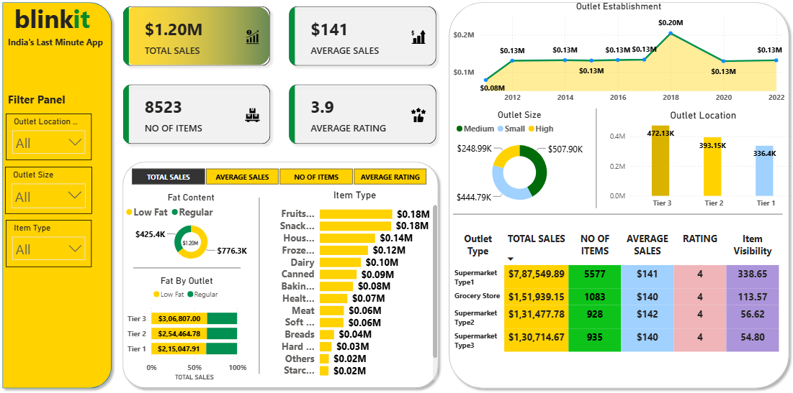

# 🛒 Blinkit Grocery Sales & Performance Power BI Dashboard

## Project Overview
This interactive Power BI dashboard analyzes sales performance, customer satisfaction ratings, inventory distribution, and channel efficiency for Blinkit (India's Last Minute App). It consolidates retail transaction data into actionable operational insights to help retail managers optimize inventory allocation, channel expansion, and product category strategy.

## Business Problem Solved
Managing fast-moving consumer goods (FMCG) across different store formats, city tiers, and product categories requires tight visibility into demand patterns and unit economics. This dashboard addresses these operational challenges by providing:
* **Channel & Store Type Performance:** Comparing total revenue, item volume, and visibility scores across Supermarkets and Grocery Stores.
* **Geographic Expansion Insights:** Tracking sales distribution across Tier 1, Tier 2, and Tier 3 location tiers to identify top-performing regions.
* **Category & Demand Mix Analysis:** Evaluating revenue contribution across major item categories (e.g., Fruits & Vegetables, Snack Foods) and customer health preferences (Low Fat vs. Regular).

## Key Insights & Metrics
* **Total Revenue & Scale:** **$1.20M** in total sales generated across **8,523 items** with an average transaction value of **$141**.
* **Customer Rating:** Maintained a consistent average customer rating of **3.9 / 5.0** across all retail channels.
* **Dominant Outlet Format:** **Supermarket Type1** was the largest revenue driver, generating **$787.55K** (65.5% of total sales) across **5,577 items**.
* **Tier Location Hierarchy:** **Tier 3 locations** generated the highest sales volume (**$472.13K**), followed by Tier 2 (**$393.15K**) and Tier 1 (**$336.40K**).
* **Outlet Size Breakdown:** **Medium-sized stores** delivered the highest overall sales at **$507.90K**, outperforming Small (**$444.79K**) and High-capacity stores (**$248.99K**).
* **Category Drivers:** **Fruits & Vegetables** ($0.18M) and **Snack Foods** ($0.18M) led total sales. **Low Fat items** accounted for **$776.3K** (64.6%) of total revenue versus Regular items at **$425.4K** (35.4%).

## Repository Structure
* [BlinkIT_Grocery_Dashboard](BlinkIT_Grocery_Dashboard.pbix): Main Power BI Desktop file containing dynamic DAX measures, data modeling, and interactive canvas components.
* [Blinkit Grocery Data](Blinkit_Grocery_Data.xlsx): Raw retail dataset containing product identifier, store type, location tier, visibility, and transaction records.
* [Dashboard_Preview](Dashboard_Preview.png): High-resolution preview screenshot of the completed executive dashboard.

## Tools & Technologies Used
* **Power BI Desktop:** Data transformation (Power Query), custom DAX measures, conditional visual formatting, and UI/UX layout.
* **Microsoft Excel / Python:** Initial data profiling, feature validation, and structural checks.
* **GitHub:** Repository management, documentation, and portfolio showcase.

## How to View & Use
1. Clone or download this repository to your local machine.
2. Open [BlinkIT_Grocery_Dashboard.pbix](BlinkIT_Grocery_Dashboard.pbix) using **Power BI Desktop**.
3. Use the **Filter Panel** on the left to dynamically segment data by **Outlet Location**, **Outlet Size**, or **Item Type**.
